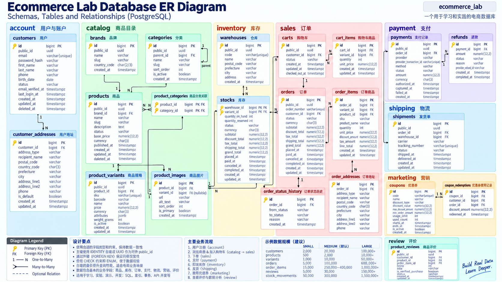

# Mini Store API — ASP.NET Core 电商学习项目

数据库名称是 **ecommerce_lab**，本仓库/业务名称是 mini_store。ASP.NET Core 10 + C# 14 + EF Core 10 服务已经连接真实数据库，并为商城和管理后台提供接口。数据库独立运行，不需要 Redis、Kafka 或其他服务。

实际执行验证见 [validation_report](docs/validation_report.md)，实际导入结果与随机样本见 [seed_report](docs/seed_report.md)，设计理由见 [database_design](docs/database_design.md)，关系图见 [ER Diagram](docs/erd.md)。


## 新手从这里开始

第一次搭建后端，请按 [手摸手从零搭建 ASP.NET Core 电商项目](手摸手从零搭建ASP.NETCore电商项目.md) 操作：从空项目、真实商品查询到完整电商服务，每一阶段都有运行检查点。

阅读现有代码，从 [Features 模块导航](Features/README.md) 进入。12 个功能目录都提供独立 README，说明文件职责、接口、业务规则、数据库关系、可执行 SQL 和练习。

## 先启动三个项目

| 项目 | 仓库 | 本地地址 |
|---|---|---|
| API 与数据库脚本 | [mini-store-api](https://github.com/wildcatDownstairs/mini-store-api) | http://127.0.0.1:5274 |
| 管理后台 | [mini-store-admin](https://github.com/wildcatDownstairs/mini-store-admin) | http://127.0.0.1:5173 |
| 电商网站 | [mini-store-web](https://github.com/wildcatDownstairs/mini-store-web) | http://127.0.0.1:5174 |

安装 .NET 10 SDK（`global.json` 固定 10.0.401，允许同版本较新 patch）、Python 3 与 PostgreSQL。C# 14 是 .NET 10 配套语言版本。

已有本任务的 `ecommerce_lab` 数据库时：

```bash
dotnet restore
dotnet tool restore
# 使用下文的 PGHOST / PGUSER 等连接环境变量
.venv/bin/python scripts/upgrade_api.py
.venv/bin/python scripts/manage_db.py comments
python3 scripts/create_admin.py  # 交互输入邮箱、角色和密码，不保存公开默认密码
python3 scripts/run_api.py
```

如果是新机器，先按下文“初始化与种子”创建数据库，再执行以上增量升级。Windows 将 `.venv/bin/python` 换成 `.venv/Scripts/python.exe`。启动器默认绑定本机 5274，自动生成的签名密钥保存在 Git 忽略的 `.local/signing-key`；不要把它上传。也可以直接为 `dotnet run --no-launch-profile` 设置 `Auth__SigningKey`（至少 32 字节随机值）与 `ASPNETCORE_ENVIRONMENT=Development`。

管理端账号独立于客户：`operator` 可操作，`viewer` 只读。商城在登录页注册新客户即可体验；种子客户使用假密码哈希，不能拿任意密码登录。访问令牌有效期 30 分钟，过期后重新登录。退出登录清除当前浏览器标签页的令牌。

两套前端分别在自己的目录运行 `pnpm install --frozen-lockfile`、`pnpm dev`。默认 API 地址为 5274，可用各自 `.env.example` 配置 `VITE_API_BASE_URL`。前台创建的订单会出现在后台；页面数据在加载、提交后刷新，不提供实时推送。

开发环境接口调试：[Swagger UI](http://127.0.0.1:5274/swagger)。点击 Authorize，粘贴登录响应中的 accessToken 即可调试受保护接口。

健康检查：[health](http://127.0.0.1:5274/health)；开发环境契约：[OpenAPI](http://127.0.0.1:5274/openapi/v1.json)，仓库内也有 [契约快照](docs/backend/openapi.json)。在 Rider 打开 [mini-store.http](mini-store.http) 可逐条运行请求。

## 后端代码怎么读

`Features/` 按功能把实体、DTO、业务服务和端点放在一起。例如修改商品功能，可以从一个目录开始阅读：

```text
mini-store/
├── Features/
│   ├── Products/
│   │   ├── Product.cs             # EF Core 实体，对应 catalog.products
│   │   ├── ProductVariant.cs      # 同一功能中的规格实体
│   │   ├── ProductDtos.cs         # API 请求与响应的数据形状
│   │   ├── ProductService.cs      # 查询、校验和业务操作
│   │   └── ProductEndpoints.cs    # 路由、权限、调用服务、HTTP 状态码
│   ├── Auth/                     # 认证；AuthConfiguration 配置令牌和权限
│   ├── Customers/                # 客户与地址
│   ├── Carts/                    # 购物车
│   ├── Checkout/                 # 报价、下单、幂等；Pricing 是纯计价函数
│   ├── Orders/                   # 订单、成交快照、状态历史
│   ├── Inventory/                # 仓库、库存、流水
│   ├── Payments/                 # 支付与退款
│   ├── Shipping/                 # 物流与履约
│   ├── Marketing/                # 优惠券与核销
│   ├── Reviews/                  # 评价与审核
│   └── Dashboard/                # 汇总查询，不需要额外的实体表
├── Data/
│   ├── StoreDbContext.cs         # 统一的表、列、关系映射
│   └── StoreDbContext.Concurrency.cs
├── Common/                       # 分页、异常、连接配置与行锁
├── Program.cs                    # 注册服务和路由
├── appsettings.json
└── mini-store.csproj
```

实体归所属功能，共享 `DbContext` 保留在 `Data`：一次下单涉及订单、库存、优惠券，必须可以在同一个事务里提交。端点不直接访问数据库，Service 不依赖 HTTP 请求上下文；当前用户的内部 ID 由端点读取后传入服务。没有额外的 Repository 或单实现接口层。

先看商品查询，再看购物车，最后看下单事务：[从 C# 到一次下单](docs/backend/learning-guide.md)。完整任务约束记录在 [实施提示词](docs/backend/development-prompt.md)，联调结果见 [验证报告](docs/backend/verification.md)。

## 格式化与验证

```bash
dotnet tool restore
dotnet csharpier format .       # 按固定工具版本格式化，长参数和 LINQ 自动换行
dotnet csharpier check .        # 只检查，不修改
dotnet build
.venv/bin/python scripts/test_api.py
```

`.editorconfig` 统一 4 空格缩进与大括号换行；CSharpier 是项目的统一排版工具。Rider 可识别 EditorConfig，批量整理后再运行 CSharpier，避免每个人手工维护不同格式。

Rider 的“记录从未实例化”可能出现在请求 DTO 上：ASP.NET Core 会从 JSON 自动创建它们，不需要显式 `new`。这些类型带有中文说明和针对该项检查的 `SuppressMessage`；EF 查询自动创建的部分实体也标明了原因。没有关闭全项目的未使用代码检查。参考 [Rider 检查说明](https://www.jetbrains.com/help/rider/ClassNeverInstantiated.Global.html)。

`test_api.py` 会创建随机名称的独立测试库，实际启动 API，验证权限、事务、并发、退款、快照等，再删除自己创建的测试库；需要当前 PostgreSQL 用户有 CREATEDB 权限。它不清空 `ecommerce_lab`。

## 数据库架构图



上图为领域概览，方便认识关系；其中部分字段是概念表示。实际字段、约束和关系以 [Mermaid ERD](docs/erd.md)、`db/*.sql` 和 `Data/` 为准。后端新增 `account.admin_users` 保存后台身份，`sales.checkout_requests` 防止重复下单；内部关联用 bigint，对外地址、订单项等使用 UUID。

## 当前业务边界

- JPY 整数金额；商品目录显示含税价，下单保存税前单价、折扣、税额及成交快照。食品 8%，其他 10%；税按行四舍五入。标准配送 ¥500，折后税前满 ¥8,000 免运费，快捷配送 ¥900。
- 服务端报价有效 10 分钟；下单重新计算并校验报价。一个订单由一个可以完整满足需求的仓库履约，下单预占，发货扣减；未付款可取消。取消保留优惠券核销记录及次数作为审计。
- 开发环境显式启用模拟支付与退款结算，无真实扣款、外部支付回调或物流服务。退款不会自动增加库存，实际退货需确认入库后调整库存并留下原因。
- 收藏暂存当前浏览器，商品示意图为本地插画；种子图片地址不代表可访问的真实商品图片。登录、价格、购物车、订单、优惠券、库存、评价等来自真实 API。
- 这是本机学习服务。外部部署还需 HTTPS、生产密钥管理和真实支付/物流集成；不要直接把开发环境模拟付款暴露给公网。

## 从哪里开始

PostgreSQL 是服务端；`psql` 是连接它的命令行客户端；database 是隔离的数据容器；schema 是数据库内的业务命名空间；table 存数据；FK 防止引用不存在的数据。

8 个 schema：account 客户；catalog 商品；inventory 库存；sales 购物车和订单；payment 支付退款；shipping 物流；marketing 优惠券；review 评价。原有 23 张业务表职责及 ON DELETE 策略在设计文档中；后端增量增加管理员与下单幂等记录，目前共 25 张表、3 个视图。订单商品名称/价格和地址使用快照，避免当前商品或地址修改改变历史记录。

## 环境与连接

```bash
psql --version
psql -X -d postgres -c 'SELECT version(),current_user,inet_server_addr(),inet_server_port();'
psql -X -d postgres -c 'SHOW port;'
psql -X -d postgres -c '\l'
```

脚本读取 libpq 标准环境变量 `PGHOST PGPORT PGUSER PGPASSWORD`，并强制目标库为 ecommerce_lab。未设置时沿用 libpq 默认值：本机 socket、5432、当前操作系统用户名。当前本机验证为 PostgreSQL 18.6 / `/tmp` socket / 5432 / aminoas。socket 连接的 inet_server_addr/port 返回 NULL 是正常的，端口用 SHOW port 查看。

`.env.example` 只包含占位值。复制成 `.env` 后**不会自动加载**，不要提交真实密码；`.gitignore` 已排除 `.env` 和 `.venv`。推荐在终端设置变量，或使用权限为 0600 的 `~/.pgpass`；密码永远不要写入 SQL、C# 或 appsettings。

```bash
export PGHOST=/tmp
export PGPORT=5432
export PGUSER="$(whoami)"
export PGDATABASE=ecommerce_lab
# 如本机需要密码：交互设置 PGPASSWORD 或配置 .pgpass，不把真实密码写在命令历史里。
psql -X -d ecommerce_lab -c 'SELECT current_database(),current_user;'
```

Windows 通常 `PGHOST=localhost`，在 PowerShell 使用 `$env:PGHOST='localhost'` 设置环境变量。libpq 需在 PATH；可安装 PostgreSQL 客户端，或在有兼容 wheel 的 Python 环境安装匹配版本 `psycopg[binary]`。本机 Python 3.14 的 binary wheel 不可用，已验证纯 Python psycopg + 本机 libpq 可用。

## 初始化与种子

在项目根目录执行：

```bash
python3 -m venv .venv
.venv/bin/python -m pip install -r seed/requirements.txt
./scripts/init_db.sh
```

PowerShell：

```powershell
python -m venv .venv
.venv/Scripts/python.exe -m pip install -r seed/requirements.txt
./scripts/init_db.ps1
```

初始化先检查数据库；不存在才创建并写入本任务标记。存在但标记或所有者不匹配则拒绝，绝不 DROP。迁移 01～07 在单一事务运行。已有完整结构可继续空库 seed；已有数据则拒绝重复 seed。无需手动逐个运行 SQL 文件。

默认 medium；选择规模：

```bash
SEED_SCALE=small ./scripts/init_db.sh      # 仅用于尚未填充的实验库
SEED_SCALE=medium ./scripts/init_db.sh
SEED_SCALE=large ./scripts/init_db.sh
# 结构已初始化且表为空时，可单独 seed：
SEED=20260918 SEED_SCALE=medium .venv/bin/python seed/seed.py
```

| 规模 | 客户 | 商品 | 变体 | 订单 | 预期订单项 |
|---|---:|---:|---:|---:|---:|
| small | 2,000 | 500 | 1,200 | 5,000 | 约 15,750 |
| medium | 20,000 | 5,000 | 12,000 | 100,000 | 约 315,000 |
| large | 100,000 | 25,000 | 60,000 | 500,000 | 约 1,575,000 |

固定随机种子与数据截止时间，可用 `SEED_AS_OF` 改为其他带时区 ISO 时间。业务日期分布、复现范围和 large 资源消耗详见设计文档。

## Reset（只重置本任务的业务数据）

**升级 API 后有两张额外业务表，旧 reset 会主动拒绝执行，以保留账号和幂等记录。当前项目不要用 reset 恢复商城；自动测试使用隔离测试库。** 下列命令仅适用于还未运行 `11_api.sql` 的原始 23 表实验库。

```bash
SEED_SCALE=medium ./scripts/reset_db.sh
# Windows: $env:SEED_SCALE='medium'; ./scripts/reset_db.ps1
```

reset 校验数据库名、数据库标记、所有者、完整业务表名单；不 DROP 数据库或 schema。仅对已知表执行 `TRUNCATE ... RESTART IDENTITY RESTRICT`，无 CASCADE。额外用户表会导致拒绝；外部 FK 也会阻止 TRUNCATE。reset、重新 seed、验证都在同一事务，失败回滚恢复原数据。执行期间会锁表，请不要同时运行 API 实验。它会覆盖这 23 张表中的实验数据，所以有需要保留的实验时先 `pg_dump -Fc ecommerce_lab -f ecommerce_lab.backup`。

reset 不升级 schema。后续结构变更应另写 migration，不能用 reset 假装迁移成功。当前 SQL 文件为首次安装版本。

## 验证与统计

```bash
psql -X -v ON_ERROR_STOP=1 -d ecommerce_lab -f db/08_verify.sql
.venv/bin/python scripts/test_db.py
psql -X -d ecommerce_lab -c 'ANALYZE;'
psql -X -d ecommerce_lab -c "SELECT pg_size_pretty(pg_database_size('ecommerce_lab'));"
```

seed 自动验证全部表行数、所有 FK、金额、优惠券、退款、库存最终与历史余额、状态链和业务时间；发现问题会直接失败回滚。seed 在验证前及提交后执行 ANALYZE。`test_db.py` 真正尝试错误写入并验证被拒绝，所有测试写入回滚；IDENTITY 因回滚产生的跳号是 PostgreSQL 正常行为。

从最基础的五条开始：[first_queries.sql](docs/first_queries.sql)。

## 常用 psql 操作

```text
psql -X -d ecommerce_lab
\conninfo                 -- 当前连接
\l                        -- 数据库
\dn                       -- schema
\dt account.*             -- 指定 schema 的表
\dt sales.*
\dt *.*                   -- 包括系统表，结果很多
\d+ sales.orders          -- 字段、约束、索引
\di sales.*               -- 索引
\dv catalog.*             -- View
\x auto                   -- 宽表自动竖排
\timing on                -- 显示耗时
\i db/09_sample_queries.sql
\q                        -- 退出
```

写 SQL 时使用 `sales.orders` 这样的完整限定名，不需要把所有领域加入 search_path。

```bash
psql -X -v ON_ERROR_STOP=1 -d ecommerce_lab -f db/09_sample_queries.sql
```

文件包含 JOIN、GROUP BY、HAVING、CTE、ROW_NUMBER、RANK、累计 SUM、时间序列、优惠券、退款率、多分类去重、OFFSET/keyset 分页，以及六条实际执行的 EXPLAIN (ANALYZE, BUFFERS)。先看实际行数与估算行数，再看扫描方式和 Buffer；不要把“顺序扫描”简单理解成错误。

## 接入 ASP.NET Core 10 / EF Core 10

项目已完成 database-first 映射，见 `Data/StoreDbContext.cs`。阅读 [后端学习路线](docs/backend/learning-guide.md) 与 [接口契约](docs/backend/api-contract.md)。旧的 [EF Core 接入笔记](docs/ef_core.md) 是学习 scaffold 的参考，不要在当前项目直接覆盖已调整的导航关系，也不要对已有数据库执行全量 CREATE TABLE migration。

## 查看和更新中文注释

所有业务表、视图及字段均在 `db/10_comments.sql` 中使用 PostgreSQL
`COMMENT ON` 保存简体中文说明，包含状态含义、金额口径、库存数量与快照规则。
初始化和 reset 会自动应用；已有数据库只更新注释时运行以下命令，不会重新 seed：

```bash
.venv/bin/python scripts/manage_db.py comments
```

Windows PowerShell 使用 `.venv/Scripts/python.exe scripts/manage_db.py comments`。
连接仍读取 `PGHOST`、`PGPORT`、`PGUSER`、`PGPASSWORD`，并检查实验库标记和表结构。
注释在同一事务中更新，缺少中文注释时会报错并回滚。新增字段后请同步修改该 SQL。

psql 可运行 `\d+ sales.orders` 查看字段说明；Rider 或 Navicat 刷新数据库结构后即可看到注释。
