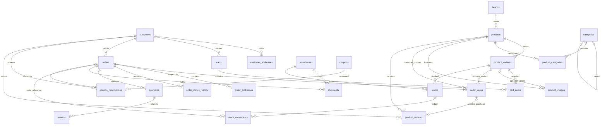

# 电商核心关系

`id` 是内部 bigint；`public_id` 是 API 的 UUID。图中一条实线关系对应数据库 FK，库存流水的订单引用通过生成列 `order_id` 落实 FK。

```mermaid
erDiagram
    customers ||--o{ customer_addresses : owns
    customers ||--o{ carts : creates
    carts ||--o{ cart_items : contains
    product_variants ||--o{ cart_items : selected
    customers ||--o{ orders : places
    orders ||--|{ order_items : contains
    orders ||--o{ order_addresses : snapshots
    orders ||--o{ order_status_history : records
    brands ||--o{ products : makes
    categories o|--o{ categories : parent
    products ||--|{ product_variants : offers
    products ||--o{ product_categories : categorized
    categories ||--o{ product_categories : includes
    products ||--o{ product_images : illustrates
    product_variants o|--o{ product_images : optional_variant
    products ||--o{ order_items : historical_product
    product_variants ||--o{ order_items : historical_variant
    orders ||--o{ payments : attempts
    payments ||--o{ refunds : refunds
    orders ||--o{ shipments : fulfills
    warehouses ||--o{ shipments : ships
    warehouses ||--o{ stocks : holds
    product_variants ||--o{ stocks : stocked
    stocks ||--o{ stock_movements : ledger
    orders o|--o{ stock_movements : order_reference
    coupons ||--o{ coupon_redemptions : redeemed
    customers ||--o{ coupon_redemptions : redeems
    orders ||--o| coupon_redemptions : discounts
    customers ||--o{ product_reviews : writes
    products ||--o{ product_reviews : receives
    order_items o|--o| product_reviews : verified_purchase
```

订单至少一项、商品至少一个变体由种子验证与业务事务保证；FK 只保证子记录引用的父记录存在，不自动保证父记录拥有子记录。
